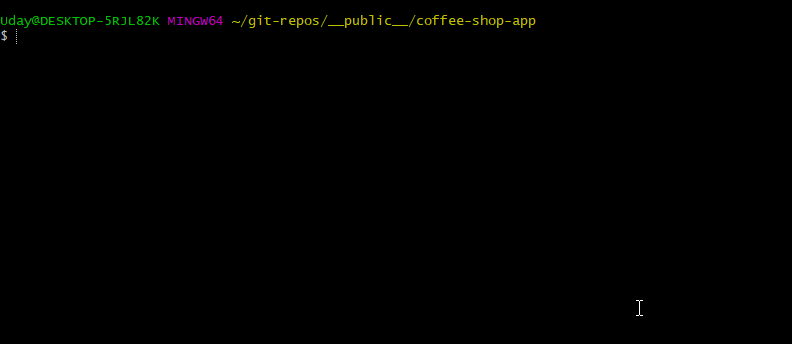
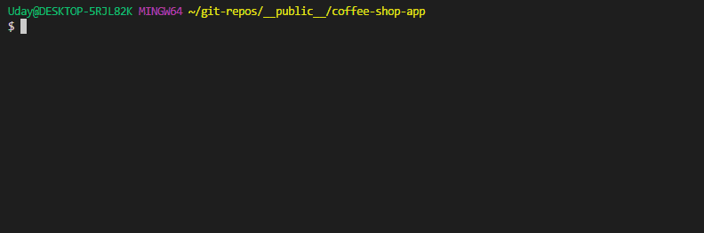
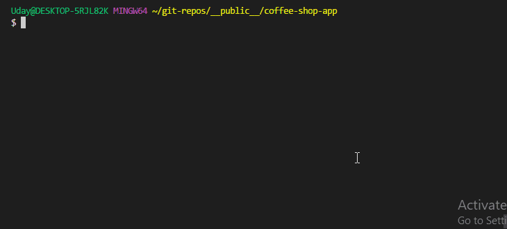
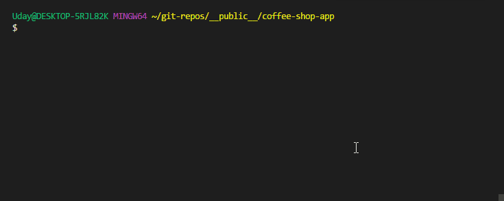
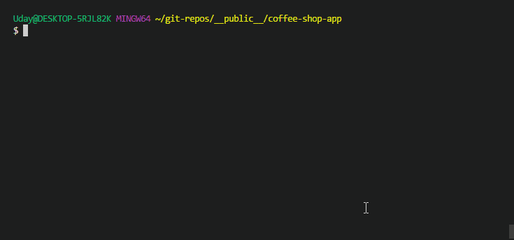

# Making CLI app with ease using commander.js and Inquirer.js

* `Commander.js` ― node module which will help us parse `process.argv` easily

* `Inquirer.js` ― help us design interactive CLI application

Let’s talk little bit about what we are going to develop. We are making a `CLI application` for `coffee shop`. Using this app, people can either `view coffee menu` or `order a coffee` of their choice. A user has choice to select coffee *`type`*, *`sugar level`*, *`regular`* or *`decaf`*, served *`hot or cold`*, served in *`mug`*, *`cup`* or *`takeaway package`*, *`stirrer`* included or not etc.

CLI commands a person can use are:

```zsh
coffee-shop list
coffee-shop order [type] -d --sugar-level low ...
```

We are going to explore more about command arguments to incorporate all choices a person can use to customize his/her coffee. But at this point, let’s get all our project dependencies installed.

Let’s initialize `package.json` and install few modules.

```zsh
mkdir coffee-shop-app && cd coffee-shop-app
npm init -y
npm install --save commander inquirer colors
```

We have created `coffee-shop-app` folder and installed `Commander.js` and `Inquirer.js` npm modules along with colors module to add some `colors` to console output. Now we need to edit `package.json` to incorporate few changes in `bin` field. Since, we want people to use `coffee-shop` command, we should have this keyword as key with value pointing to `bin/index.js` file. Our `package.json` should look like:

```json
// package.json

{
    "name": "coffee-shop-app",
    "version": "1.0.0",
    "preferGlobal": true,
    "bin": {
        "coffee-shop": "./bin/index.js"
    },
    "dependencies": {
        "colors": "^1.2.1",
        "commander": "^2.15.1",
        "inquirer": "^5.2.0"
    }
}
```

In `lib` folder, we will have two files ― `list.js` and `order.js` which will take responsibility of **listing menu** and **ordering coffee** individually. From `index.js`, we need to route user request to one of these files depending on sub-commands (*`list` or `order`*). We will also have `values.js` file inside `lib` folder to export things like coffee types, sugar levels etc.

We are first going to create the app with `Commander.js` and then simplify the user input using `Inquierer.js`.


Let’s first export values in `values.js` like below:

```js
// lib/values.js

// coffee types
exports.types = [
    {name: 'Espresso', price: '$5.99'},
    {name: 'Latte', price: '$4.50'},
    {name: 'Cappuchino', price: '$3.99'},
    {name: 'Americano', price: '$2.50'},
    {name: 'Macchiato', price: '$3.50'},
];
exports.typesPlain = exports.types.map(function(o) {
    return o.name + ' (' + o.price + ')'; // convert to one line
});

// sugar levels
exports.sugar = [
    {name: 'Low', spoons: '1'},
    {name: 'Medium', spoons: '2'},
    {name: 'High', spoons: '3'},
    {name: 'Very High', spoons: '4'},
];
exports.sugarPlain = exports.sugar.map(function(o) {
    return o.name + ' (' + o.spoons + ' spoons)'; // convert to one line
});

// served in
exports.servedIn = [
    "Mug",
    "Cup",
    "Takeway package"
];
```

Then inside `list.js`, we are going to export a function which prints list of coffee drinks as `shop menu`, like below:

```js
// lib/list.js

const colors = require('colors');
const { types } = require('./values');

// export function to list coffee
module.exports = function() {
    console.log('COFFEE MENU');
    console.log('------------------');

    // list on separate lines
    types.forEach((type) => {
        console.log('%s %s', colors.bold(type.name), colors.grey('/ '+ type.price));
    });
};
```

Above code imports `types` from `values.js` and exports a function which prints coffee menu of the shop. We also have used some colors to print this menu, which is nice.

We can test if `list.js` *exported function* is working properly, by implementing inside `index.js`.

```js
// ./bin/index.js
const program = require('commander');
// import function to list coffeee menu
const list = require('../lib/list');
// print menu
list();
```



Above output is impressive as we know that command `coffee-shop` will use `bin/index.js` along with whatever arguments passed to it, hence `coffee-shop sub-command --arguments` command is just like `bin/index.js sub-command --arguments` command.

Let’s implement our first sub-command which is `coffee-shop list` which should output above result shown in gif. Which means `bin/index.js` list command should output that same result. This is where *`Commander.js`* comes into play.

**`Commander`** parses `process.argv` and gives very easy interface to work with. If you check documentation here at https://github.com/tj/commander.js, there are many methods to construct a CLI command. For our use case, we are using **`Command-specific options`** (https://github.com/tj/commander.js/#command-specific-options) flavor.

```js
// index.js


#!/usr/bin/env node

const program = require('commander');

// import function to list coffee menu
const list = require('../lib/list');

/*******************************************/

// Print coffee drinks menu
// $ coffee-shop list
// $ coffee-shop ls
program
    .command('list') // sub-command name
    .alias('ls') // alternative sub-command is `al`
    .description('List coffee menu') // command description

    // function to execute when command is uses
    .action(function () {
        list();
    });


// allow commander to parse `process.argv`
program.parse(process.argv);
```

In above program, we are creating a sub-command `list` for main command `coffee-shop` so that user can use `coffee-shop list` command to print coffee menu. User can also use alias `ls` like `coffee-shop ls` which also does the same thing. `description` will help user understand use of this command when they use `coffee-shop --help` command as `help` argument is provided by **`Commander`** by default. In `action` method, we are executing `list` function which prints the coffee menu. `action` method will execute only when user uses `list` sub-command. **We need to pass `process.argv` to Commander to parse user input** from which is last line of the program.

It’s time to install our app globally from local source code. Don’t forget to add *shebang* line as the first line in `index.js`, like done in above program.

```zsh
npm install -g ./
```

After installation is completed, we can use command `coffee-shop list` or `coffee-shop ls` which should print coffee menu like below.

*Command `coffee-shop` will not do anything as no sub-command was used with it. But you can figure out a way to throw error when no sub-command is used.*



We have successfully created our first `list` sub-command. Let’s now move to `order` sub-command.

```js
// index.js


#!/usr/bin/env node

const program = require('commander');
const colors = require('colors');

/*******************************************/

// Order a coffee
// $ coffee-shop order type arguments
// $ coffee-shop o type arguments
program
    .command('order <type>') // sub-command name, coffeeType = type, required
    .alias('o') // alternative sub-command is `o`
    .description('Order a coffee') // command description
    .option('-s, --sugar [value]', 'Sugar level', "Low") // args.sugar = value, optional, default is 'Low'
    .option('-d, --decaf', "Decaf coffee") // args.decaf = true/false, optional, default is `undefined`
    .option('-c, --cold', "Cold coffee") // args.cold = true/false, optional, default is `undefined`
    .option('-S, --served-in [value]', "Served in", "Mug") // args.servedIn = value, optional, default is 'Mug'
    .option('--no-stirrer', 'Do not add stirrer') // args.stirrer = true/false, optional, default is `true`

    // function to execute when command is uses
    .action(function (coffeeType, args) {
        console.log("YOUR ORDER");
        console.log('------------------');

        console.log('Coffee type is %s', colors.green(coffeeType));
        console.log('args.sugar %s', colors.green(args.sugar));
        console.log('args.decaf %s', colors.green(args.decaf));
        console.log('args.cold %s', colors.green(args.cold));
        console.log('args.servedIn %s', colors.green(args.servedIn));
        console.log('args.stirrer %s', colors.green(args.stirrer));
    });


// allow commander to parse `process.argv`
program.parse(process.argv);
```

Above is a sample code to show how `order` sub-command will be implemented. The new `option` method is used to define arguments used with command like below.



Since we don’t want to present above output to the user because it’s not neat and we want `order.js` file to handle output related functionality. But there is another **User Experience** related problem.

A user needs to know all command arguments to be able to use this app. But nobody is going to read manual before using this app, trust me. Hence we need to figure out how to present **choices** to the user to choose their **preferences** from. This is where **`Inquirer`** comes into play. **`Inquirer`** will **eliminate implementation of all command arguments** from **`Commander`** and take responsibility on its own by **asking user inputs in interactive questions**.

Let’s create a simple **Inquirer** program to see how it works. Basically, **Inquirer** accepts a list of questions. A question has **`name`** (variable name), description or **`message`** to present while asking question, **`type`** of question (yes/no or list choice or other) and other data. Let’s modify `index.js` to implement a simple example.

```js
// index.js

#!/usr/bin/env node

const inquirer = require('inquirer');
const values = require('../lib/values');

const questions = [
    { type: 'list', name: 'coffeType', message: 'Choose coffee type', choices: values.typesPlain },
    { type: 'list', name: 'sugarLevel', message: 'Choose your sugar level', choices: values.sugarPlain },
    { type: 'confirm', name: 'decaf', message: 'Do you prefer your coffee to be decaf?', default: false },
    { type: 'confirm', name: 'cold', message: 'Do you prefer your coffee to be cold?', default: false },
    { type: 'list', name: 'servedIn', message: 'How do you prefer your coffee to be served in', choices: values.servedIn },
    { type: 'confirm', name: 'stirrer', message: 'Do you prefer your coffee with a stirrer?', default: true },
];

inquirer
    .prompt(questions)
    .then(function (answers) {
        console.log(answers);
    })
```

In above example, we have written simple **`Inquirer`** program to test how it works. `inquirer.prompt` takes question list and returns a `Promise`. `Promise` is resolved when user answers all the question. Promise returns answers to all the questions in JavaScript Object. Since `index.js` is executed with `coffee-shop` command, we can try above program like below:



As you can see from above output, **`Inquirer`** makes CLI application interactive. We got rid of command line arguments completely to get same user input data. Since this was just an example, we need to implement this code inside `lib/order.js` and print order in neat format. We are going to use **`pad`** npm module to add some padding to console output.

First of all, let’s modify `index.js` to implement order sub-command along with previous `list` sub-command.

```js
// index.js

#!/usr/bin/env node

const program = require('commander');

// import function to list coffeee menu
const list = require('../lib/list');

// import function to order a coffee
const order = require('../lib/order');

/*******************************************/

// Print coffee drinks menu
// $ coffee-shop list
// $ coffee-shop ls
program
    .command('list') // sub-command name
    .alias('ls') // alternative sub-command is `al`
    .description('List coffee menu') // command description

    // function to execute when command is uses
    .action(function () {
        list();
    });


// Order a coffee
// $ coffee-shop order
// $ coffee-shop o
program
    .command('order') // sub-command name
    .alias('o') // alternative sub-command is `o`
    .description('Order a coffee') // command description

    // function to execute when command is uses
    .action(function () {
        order();
    });


// allow commander to parse `process.argv`
program.parse(process.argv);
```

In `order.js`, we have to export a function which will print order information. It is better if we implement `Inquirer` code inside `order.js` file to make this module locally available as well.

```js
// lib/order.js

const inquirer = require('inquirer');
const colors = require('colors');
const pad = require('pad');
const values = require('../lib/values');

const questions = [
    { type: 'list', name: 'coffeType', message: 'Choose coffee type', choices: values.typesPlain },
    { type: 'list', name: 'sugarLevel', message: 'Choose your sugar level', choices: values.sugarPlain },
    { type: 'confirm', name: 'decaf', message: 'Do you prefer your coffee to be decaf?', default: false },
    { type: 'confirm', name: 'cold', message: 'Do you prefer your coffee to be cold?', default: false },
    { type: 'list', name: 'servedIn', message: 'How do you prefer your coffee to be served in', choices: values.servedIn },
    { type: 'confirm', name: 'stirrer', message: 'Do you prefer your coffee with a stirrer?', default: true },
];

module.exports = function () {
    inquirer
        .prompt(questions)
        .then(function (answers) {
            console.log('YOUR ORDER');
            console.log('------------------');

            console.log(pad(colors.grey('Coffee type: '), 30), answers.coffeType);
            console.log(pad(colors.grey('Sugar level: '), 30), answers.sugarLevel);
            console.log(pad(colors.grey('Decaf: '), 30), answers.decaf);
            console.log(pad(colors.grey('Cold: '), 30), answers.cold);
            console.log(pad(colors.grey('Served in: '), 30), answers.servedIn);
            console.log(pad(colors.grey('With stirrer: '), 30), answers.stirrer);
            
        });
};
```

We are done with our program. Now let’s see entire application in action.



Now you can choose to publish your package or keep to yourself. `Commander` and `Inquirer` combination made coffee-shop application more interactive and fun. There are lot of other fun stuff you can do with these modules, hence I urge you to check out their documentation.

*There is another CLI application builder module name **[`vorpal`](https://github.com/dthree/vorpal)** which provide functionality of `Commander` and `Inquirer` combined, more or less.*

To make this module available locally without CLI interface, we can create `index.js` in root directory of the module and export `list` and 
`order` functions.

```js
// ./index.js
exports.list = require('./lib/list');
exports.order = require('./lib/order');
```
