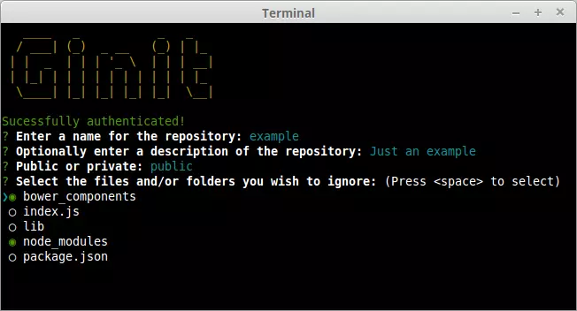
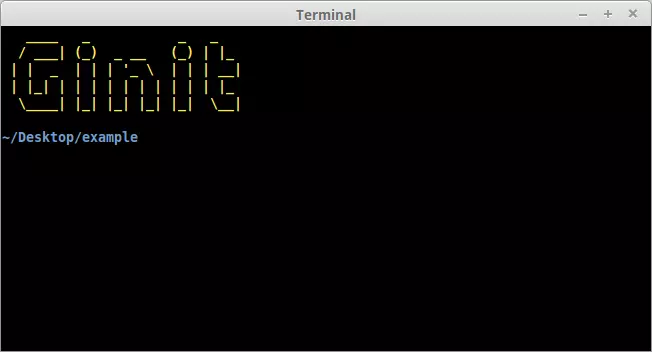
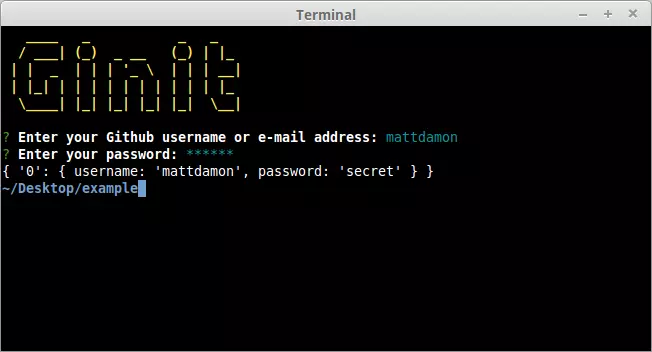
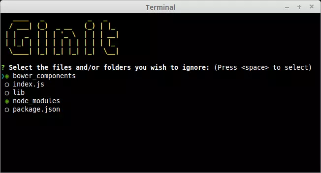

# [Build a JavaScript command line interface (CLI) w/ Node.js](https://www.sitepoint.com/javascript-command-line-interface-cli-node-js/)



For this tutorial, we’re going to create a command-line utility which I’m calling **ginit**. It’s `git init`, but on steroids.

`git init` initializes a Git repository in the current folder. However, that’s usually only one of a number of repetitive steps involved in the process of hooking up a new or existing project to Git. For example, as part of a typical workflow, you may well:

1. initialize the local repository by running `git init`

2. create a remote repository, for example on *GitHub* or *Bitbucket* — typically by leaving the command line and firing up a web browser

3. add the remote

4. create a `.gitignore` file

5. add your project files

6. commit the initial set of files

7. push up to the remote repository

**ginit** will create a Git repository in the current folder, create a remote repository — we’ll be using GitHub for this — and then add it as a remote. Then it will provide a simple interactive “wizard” for creating a `.gitignore` file, add the contents of the folder and push it up to the remote repository. It might not save you hours, but it’ll remove some of the initial friction when starting a new project.

## The application dependencies

We’ll be looking at a couple of libraries for enhancing the display: `chalk` for colorizing the output and `clui` to add some additional visual components. Just for fun, we’ll use `figlet` to create a fancy ASCII-based banner, and we’ll also use `clear` to clear the console.

In terms of input and output, the low-level `Readline` Node.js module could be used to prompt the user and request input, and in simple cases is more than adequate. But we’re going to take advantage of a third-party package which adds a greater degree of sophistication — `Inquirer`. As well as providing a mechanism for asking questions, it also implements simple input controls: think radio buttons and checkboxes, but in the console.

We'll also be using `minimalist` to parse command-line arguments.

Here's a complete list of the packages we'll use specifically for developing on the command line:

* `chalk` ― colorizes the output

* `clear` ― clears the terminal screen

* `clui` ― draws command-line tables, gauges, and spinners

* `figlet` ― creates ASCII art from text

* `inquirer` ― creates interactive command-line user interface

* `minimist` ― parses argument options

* `configstore` ― easily loads and saves config w/o having to think about where and how

Additionally, we'll also be using the following:

* `@octokit/rest` ― a GitHub REST API client for Node.js

* `@octokit/auth-basic` ― an implementation of one of GitHub's authentication strategies

* `lodash` ― a JavaScript utility library

* `simple-git` ― a tool for running Git commands in a Node.js application

* `touch` ― a tool for implementing the Unix touch command

## Getting started

Create a new directory for the project. You don’t have to call it `ginit`, of course:

```
mkdir ginit
cd ginit
```

Create a new `package.json` file:

```
npm init -y
```

And edit it to look like so:

```json
{
  "name": "ginit",
  "version": "1.0.0",
  "description": "'git init' on steroids",
  "main": "index.js",
  "scripts": {
    "test": "echo \"Error: no test specified\" && exit 1"
  },
  "keywords": [
    "Git",
    "CLI"
  ],
  "author": "<YOUR NAME>",
  "license": "ISC"
}
```

Now install the dependencies:

```
npm install chalk clear clui figlet inquirer minimist configstore @octokit/rest @octokit/auth-basic lodash simple-git touch
```

Now create an `index.js` file in the same folder and `require` the following dependencies:

```js
const chalk = require('chalk');
const clear = require('clear');
const figlet = require('figlet');
```

## Adding some helper methods

We're going to create a `lib` folder where we'll split our helper code into modules:

* **`file.js`** ― basic file management

* **`inquirer.js`** ― command-line user interaction

* **`github.js`** ― access token management

* **`repo.js`** ― Git repository management

Let’s start with `lib/files.js`. Here, we need to:

* get the current directory (to get a default repo name)

* check whether a directory exists (to determine whether the current folder is already a Git repository by looking for a folder named `.git`).

This sounds straightforward, but there are a couple of edge cases to take into consideration.

Firstly, you might be tempted to use the `fs` module’s `realpathSync` method to get the current directory:

```js
path.basename(path.dirname(fs.realpathSync(__filename)));
```

This will work when we’re calling the application from the same directory (for example, using `node index.js`), but bear in mind that we’re going to be making our console application available globally. This means we’ll want the name of the directory we’re working in, not the directory where the application resides. For this purpose, it’s better to use `process.cwd`:

```js
path.basename(process.cwd());
```

Secondly, the preferred method of checking whether a file or directory exists **keeps changing**. The current way is to use `existsSync`. This returns `true` if the path exists, `false` otherwise.

Finally, it’s worth noting that when you’re writing a command-line application, using the synchronous version of these sorts of methods is just fine.

Putting that all together, let’s create a utility package in `lib/files.js`:

```js
// lib/files.js

const fs = require('fs');
const path = require('path');

module.exports = {
  getCurrentDirectoryBase: () => {
    return path.basename(process.cwd());
  },

  directoryExists: (filePath) => {
    return fs.existsSync(filePath);
  }
};
```

Go back to `index.js` and ensure you `require` the new file:

```js
// index.js

const files = require('./lib/files');
```

With this in place, we can start developing the application.

## Initializing the Node CLI

Now let’s implement the start-up phase of our console application.

In order to demonstrate some of the packages we’ve installed to enhance the console output, let’s clear the screen and then display a banner:

```js
// index.js

clear();

console.log(
  chalk.yellow(
    figlet.textSync('Ginit', { horizontalLayout: 'full' })
  )
);
```

You can run the application using `node index.js`. The output from this is shown below.



Next up, let's run a simple check to ensure that the current folder isn't already a Git repository. That's easy: we just check for the existence of a `.git` folder using the utility method we just created.

```js
// index.js

if (files.directoryExists('.git')) {
  console.log(chalk.red('Already a Git repository!'));
  process.exit();
}
```

Tip: notice we're using the `chalk` module to show a red-colored message.

## Prompting the user for input

The next thing we need to do is create a function that will prompt the user for their GitHub credentials.

We can use `Inquirer` for this. The module includes a number of methods for various types of prompts, which are roughly analogous to HTML form controls. In order to collect the user’s GitHub username and password, we’re going to use the `input` and `password` types respectively.

First, create `lib/inquirer.js` and insert this code:

```js
// lib/inquirer.js

module.exports = {
  askGithubCredentials: () => {
    const questions = [
      {
        name: 'username',
        type: 'input',
        message: 'Enter your GitHub username or e-mail address:',
        validate: function( value ) {
          if (value.length) {
            return true;
          } else {
            return 'Please enter your username or e-mail address.';
          }
        }
      },
      {
        name: 'password',
        type: 'password',
        message: 'Enter your password:',
        validate: function(value) {
          if (value.length) {
            return true;
          } else {
            return 'Please enter your password.';
          }
        }
      }
    ];
    return inquirer.prompt(questions);
  },
};
```
As you can see, `inquirer.prompt()` asks the user a series of questions, provided in the form of an array as the first argument. Each question is made up of an object which defines the `name` of the field, the `type` (we're just using `input` and `password` respectively here, but later we'll look at a more advanced example), and the prompt (`message`) to display.

The input the user provides will be passed in to the calling function as a `Promise`. If successful, we’ll end up with a simple object with two properties — `username` and `password`.

You can test all of this out by adding the following to `index.js`:

```js
// index.js

const inquirer  = require('./lib/inquirer');

const run = async () => {
  const credentials = await inquirer.askGithubCredentials();
  console.log(credentials);
};

run();
```

Then run the script using `node index.js`



Tip: when you're done testing, don't forget to remove the line `const inquirer = require('./lib/inquirer');` from `index.js`, as we won't actually need it in this file.

## Dealing w/ GitHub authentication

The next step is to create a function to retrieve an OAuth token for the GitHub API. Essentially, we’re going to “exchange” the username and password for a token.

Of course, we don’t want users to have to enter their credentials every time they use the tool. Instead, we’ll store the OAuth token for subsequent requests. This is where the `configstore` package comes in.

### Storing config

Storing config is outwardly quite straightforward: you can simply read and write to/from a JSON file without the need for a third-party package. However, the configstore package provides a few key advantages:

1. It determines the most appropriate location for the file for you, taking into account your operating system and the current user.

2. There’s no need to explicitly read or write to the file. You simply modify a `configstore` object and that’s taken care of for you in the background.

To use it, simply create an instance, passing it an application identifier. For example:

```js
const Configstore = require('configstore');
const conf = new Configstore('ginit');
```

If the `configstore` file doesn't exist, it'll return an empty object and create the file in the background. If there's already a `configstore` file, the contents will be made available to your application. You can now use `conf` as a simple object, getting or setting properties as required. As mentioned above, you don't need to worry about saving it afterwards. That gets taken care of for you.

Tip: on macOS, you'll find the file in `/Users/[YOUR-USERNME]/.config/configstore/ginit.json`. On Linux, it's in `/home/[YOUR-USERNME]/.config/configstore/ginit.json`.

## Communicating w/ the GitHub API

Let’s create a library for handling the GitHub token. Create the file `lib/github.js` and place the following code inside it:

```js
// lib/github.js

const CLI = require('clui');
const Configstore = require('configstore');
const Octokit = require('@octokit/rest');
const Spinner = CLI.Spinner;
const { createBasicAuth } = require("@octokit/auth-basic");

const inquirer = require('./inquirer');
const pkg = require('../package.json');

const conf = new Configstore(pkg.name)
```

Now let’s add the function that checks whether we’ve already got an access token. We’ll also add a function that allows other libs to access `octokit`(GitHub) functions:

```js
// lib/github.js

let octokit;

module.exports = {
  getInstance: () => {
    return octokit;
  },

  getStoredGithubToken: () => {
    return conf.get('github.token');
  },
};
```

If a `conf` object exists and it has `github.token` property, this means that there's already a token in storage. In this case, we return the token value back to the invoking function, which we'll get to later on.

If no token is detected, we need to fetch one. Of course, getting an OAuth token involves a network request, which means a short wait for the user. This gives us an opportunity to look at the `clui` package which provides some enhancements for console-based applications, among them an animated spinner.

Creating a spinner is easy:

```js
const status = new Spinner('Authenticating you, please wait...');
status.start();
```

Once you're done, simply stop it and it will disappear from the screen:

```js
status.stop();
```

Tip: you can also set the caption dynamically using the `update` method. This could be useful if you have some indication of progress ― for example, displaying the percentage complete.

Here's the code to authenticate w/ GitHub:

```js
// lib/github.js

module.exports = {
  getInstance: () => { ... },
  getStoredGithubToken: () => { ... },

  getPersonalAccesToken: async () => {
    const credentials = await inquirer.askGithubCredentials();
    const status = new Spinner('Authenticating you, please wait...');

    status.start();

    const auth = createBasicAuth({
      username: credentials.username,
      password: credentials.password,
      async on2Fa() {
        // TBD
      },
      token: {
        scopes: ['user', 'public_repo', 'repo', 'repo:status'],
        note: 'ginit, the command-line tool for initalizing Git repos'
      }
    });

    try {
      const res = await auth();

      if(res.token) {
        conf.set('github.token', res.token);
        return res.token;
      } else {
        throw new Error("GitHub token was not found in the response");
      }
    } finally {
      status.stop();
    }
  },
};
```

Let's step through this:

1. We prompt the user for their credentials using the `askGithubCredentials` method we defined earlier.

2. We use the `createBasicAuth` method to create an `auth` function, which we'll call in the next step. We pass the user's username and password to this method, as well as a token object w/ two properties:

  * `note` ― a note to remind us what the OAuth token is for

  * `scopes` ― a list of scopes that this authorization is in.

3. We then `await` the result of calling the `auth` function inside a `try` block.

4. If authentication is successful and a token is present in the response, we set it in the `configstore` for next time and return the token.

5. If the token is missing, or authentication doesn't succeed for whatever reason, the error will bubble on up the stack so that we can catch it in `index.js`. We'll implement this functionality later.

During the course of development, you may find you need to delete ginit’s access token — identifiable by the `note` parameter supplied above — so that you can re-generate it.

If you’ve been following along and would like to try out what we have so far, you can update `index.js` as follows:

```js
// index.js

const github = require('./lib/github');

...

const run = async () => {
  let token = github.getStoredGithubToken();
  if(!token) {
    token = await github.getPersonalAccesToken();
  }
  console.log(token);
};
```

The first time you run it, you should be prompted for your username and GitHub password. The app should then create a personal access token on GitHub and save the token to the `configstore`, before logging it to the console. Every time you run the app after that, the app will pull the token straight from the `configstore` and log that to the screen.

## Dealing w/ two-factor authentication

Hopefully you noticed the `on2Fa` method in the code above. This will be called when a user has two-factor authentication enabled on their GitHub account. Let’s fill that out now:

```js
// inquirer.js

const inquirer = require('inquirer');

module.exports = {
  askGithubCredentials: () => { ... },

  getTwoFactorAuthenticationCode: () => {
    return inquirer.prompt({
      name: 'twoFactorAuthenticationCode',
      type: 'input',
      message: 'Enter your two-factor authentication code:',
      validate: function(value) {
        if (value.length) {
          return true;
        } else {
          return 'Please enter your two-factor authentication code.';
        }
      }
    });
  },
};
```

We can call the `getTwoFactorAuthenticationCode` method from within the `on2Fa` method, like so:

```js
// github.js

async on2Fa() {
  status.stop();
  const res = await inquirer.getTwoFactorAuthenticationCode();
  status.start();
  return res.twoFactorAuthenticationCode;
},
```

And now our app can handle GitHub accounts with two-factor authentication enabled.

## Creating a repository

Once we’ve got an OAuth token, we can use it to create a remote repository with GitHub.

Again, we can use Inquirer to ask a series of questions. We need a name for the repo, we’ll ask for an optional description, and we also need to know whether it should be public or private.

We’ll use `minimist` to grab defaults for the name and description from optional command-line arguments. For example:

```zsh
ginit my-repo "just a test repository"
```

This will set the default name to `my-repo` and the description to `just a test repository`.

The following line will place the arguments in an array indexed by an underscore:

```js
const argv = require('minimist')(process.argv.slice(2));
// { _: [ 'my-repo', 'just a test repository' ] }
```

Tip: this use case only really scratches the surface of the minimist package. You can also use it to interpret flags, switches, and name/value pairs. Check out the documentation for more information.

We’ll write code to parse the command-line arguments and ask a series of questions. First, update `lib/inquirer.js` as follows:

```js
// lib/inquirer.js

const inquirer = require('inquirer');
const files = require('./files');

module.exports = {
  askGithubCredentials: () => { ... },
  getTwoFactorAuthenticationCode: () => { ... },

  askRepoDetails: () => {
    const argv = require('minimist')(process.argv.slice(2));

    const questions = [
      {
        type: 'input',
        name: 'name',
        message: 'Enter a name for the repository:',
        default: argv._[0] || files.getCurrentDirectoryBase(),
        validate: function( value ) {
          if (value.length) {
            return true;
          } else {
            return 'Please enter a name for the repository.';
          }
        }
      },
      {
        type: 'input',
        name: 'description',
        default: argv._[1] || null,
        message: 'Optionally enter a description of the repository:'
      },
      {
        type: 'list',
        name: 'visibility',
        message: 'Public or private:',
        choices: [ 'public', 'private' ],
        default: 'public'
      }
    ];
    return inquirer.prompt(questions);
  },
};
```

Next, create the file `lib/repo.js` and add this code:

```js
// lib/repo.js

const CLI = require('clui');
const fs = require('fs');
const git = require('simple-git/promise')();
const Spinner = CLI.Spinner;
const touch = require("touch");
const _ = require('lodash');

const inquirer = require('./inquirer');
const gh = require('./github');

module.exports = {
  createRemoteRepo: async () => {
    const github = gh.getInstance();
    const answers = await inquirer.askRepoDetails();

    const data = {
      name: answers.name,
      description: answers.description,
      private: (answers.visibility === 'private')
    };

    const status = new Spinner('Creating remote repository...');
    status.start();

    try {
      const response = await github.repos.createForAuthenticatedUser(data);
      return response.data.ssh_url;
    } finally {
      status.stop();
    }
  },
};
```

Once we have that information, we can simply use the GitHub package to `create a repo`, which will give us a URL for the newly created repository. We can then set that up as a remote in our local Git repository. First, however, let’s interactively create a `.gitignore` file.

## Creating a .gitignore file

For the next step, we’ll create a simple command-line “wizard” to generate a `.gitignore` file. If the user is running our application in an existing project directory, let’s show them a list of files and directories already in the current working directory, and allow them to select which ones to ignore.

The Inquirer package provides a `checkbox` input type for just that.



The first thing we need to do is scan the current directory, ignoring the `.git` folder and any existing `.gitignore` file (we do this by making use of lodash’s `without` method):

```js
const filelist = _.without(fs.readdirSync('.'), '.git', '.gitignore');
```

If there’s nothing to add, there’s no point in continuing, so let’s simply `touch` the current `.gitignore` file and bail out of the function:

```js
if (filelist.length) {
  ...
} else {
  touch('.gitignore');
}
```

Finally, let’s utilize Inquirer’s checkbox “widget” to list the files. Insert the following code in `lib/inquirer.js`:

```js
// lib/inquirer.js

askIgnoreFiles: (filelist) => {
  const questions = [
    {
      type: 'checkbox',
      name: 'ignore',
      message: 'Select the files and/or folders you wish to ignore:',
      choices: filelist,
      default: ['node_modules', 'bower_components']
    }
  ];
  return inquirer.prompt(questions);
},
```

Notice that we can also provide a list of defaults. In this case, we’re pre-selecting `node_modules` and `bower_components`, should they exist.

With the Inquirer code in place, we can now construct the `createGitignore()` function. Insert this code in `lib/repo.js`:

```js
// lib/repo.js

createGitignore: async () => {
  const filelist = _.without(fs.readdirSync('.'), '.git', '.gitignore');

  if (filelist.length) {
    const answers = await inquirer.askIgnoreFiles(filelist);

    if (answers.ignore.length) {
      fs.writeFileSync( '.gitignore', answers.ignore.join( '\n' ) );
    } else {
      touch( '.gitignore' );
    }
  } else {
    touch('.gitignore');
  }
},
```

Once “submitted”, we then generate a `.gitignore` by joining up the selected list of files, separated with a newline. Our function now pretty much guarantees we’ve got a `.gitignore` file, so we can proceed with initializing a Git repository.

## Interacting w/ Git from within the app

There are a number of ways to interact with Git, but perhaps the simplest is to use the `simple-git` package. This provides a set of chainable methods which, behind the scenes, run the Git executable.

These are the repetitive tasks we'll use it to automate:

1. run `git init`

2. add the `.gitignore` file

3. add the remaining contents of the working directory

4. perform an initial commit

5. add the newly created remote repository

6. push the working directory up to the remote

Insert the following code in `lib/repo.js`:

```js
// lib/repo.js

setupRepo: async (url) => {
  const status = new Spinner('Initializing local repository and pushing to remote...');
  status.start();

  try {
    git.init()
      .then(git.add('.gitignore'))
      .then(git.add('./*'))
      .then(git.commit('Initial commit'))
      .then(git.addRemote('origin', url))
      .then(git.push('origin', 'master'));
  } finally {
    status.stop();
  }
},
```

## Putting it all together

First, let’s set a helper function in `lib/github.js` for setting up an `oauth` authentication:

```js
// lib/github.js

githubAuth: (token) => {
  octokit = new Octokit({
    auth: token
  });
},
```

Next, we create a function in `index.js` for handling the logic of acquiring the token. Place this code before the `run()` function:

```js
// index.js


const getGithubToken = async () => {
  // Fetch token from config store
  let token = github.getStoredGithubToken();
  if(token) {
    return token;
  }

  // No token found, use credentials to access GitHub account
  token = await github.getPersonalAccesToken();

  return token;
};
```

Finally, we update the `run()` function by writing code that will handle the main logic of the app:

```js
// index.js

const repo = require('./lib/repo');

...

const run = async () => {
  try {
    // Retrieve & Set Authentication Token
    const token = await getGithubToken();
    github.githubAuth(token);

    // Create remote repository
    const url = await repo.createRemoteRepo();

    // Create .gitignore file
    await repo.createGitignore();

    // Set up local repository and push to remote
    await repo.setupRepo(url);

    console.log(chalk.green('All done!'));
  } catch(err) {
      if (err) {
        switch (err.status) {
          case 401:
            console.log(chalk.red('Couldn\'t log you in. Please provide correct credentials/token.'));
            break;
          case 422:
            console.log(chalk.red('There is already a remote repository or token with the same name'));
            break;
          default:
            console.log(chalk.red(err));
        }
      }
  }
};
```

As you can see, we ensure the user is authenticated before calling all of our other functions (`createRemoteRepo()`, `createGitignore()`, `setupRepo()`) sequentially. The code also handles any errors and offers the user appropriate feedback.

At this point you should have a working app. Give it a try and satisfy yourself that it works as expected.

## Making the ginit command available globally

The one remaining thing to do is to make our command available globally. To do this, we’ll need to add a *shebang* line to the top of `index.js`:

```js
// index.js

#!/usr/bin/env node
```

Next, we need to add a `bin` property to our `package.json` file. This maps the command name (`ginit`) to the name of the file to be executed (relative to `package.json`):

```json
// package.json

"bin": {
  "ginit": "./index.js"
}
```

After that, install the module globally and you’ll have a working shell command:

```
npm install -g
```

If you want to confirm the install worked, you can list your globally installed Node modules using this:

```
npm ls -g --depth=0
```

