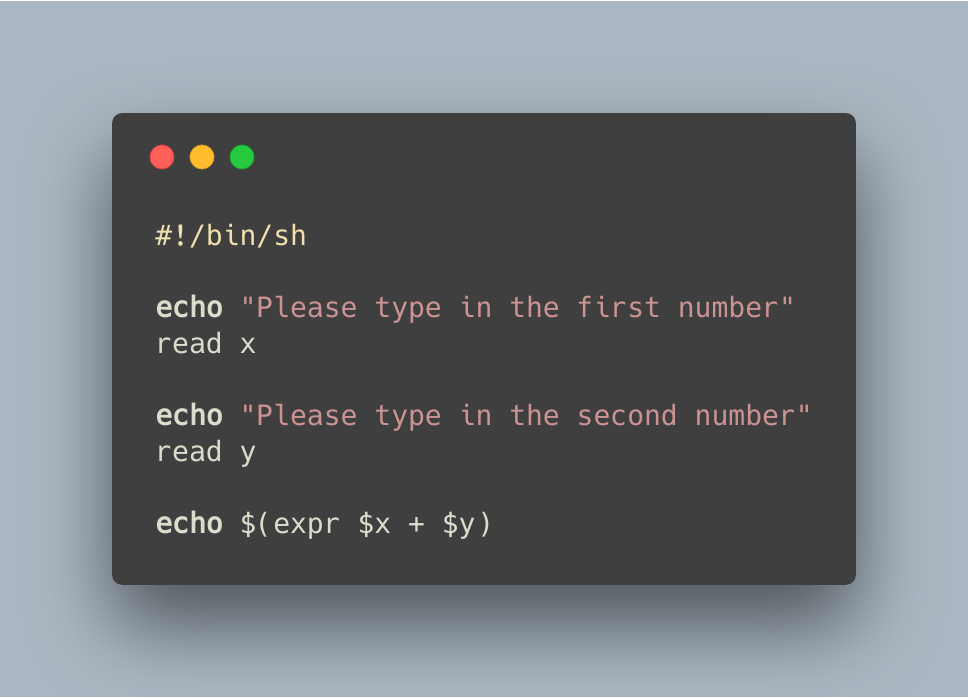
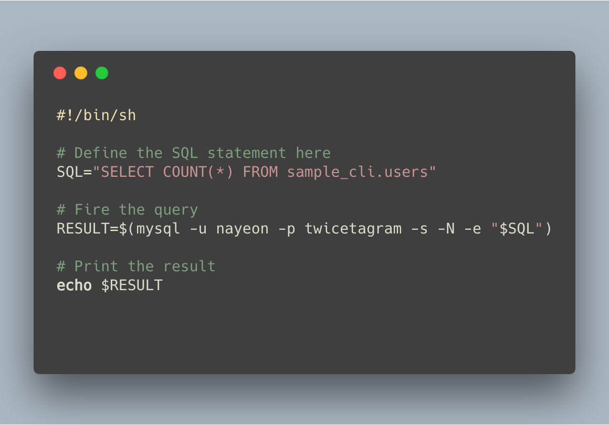
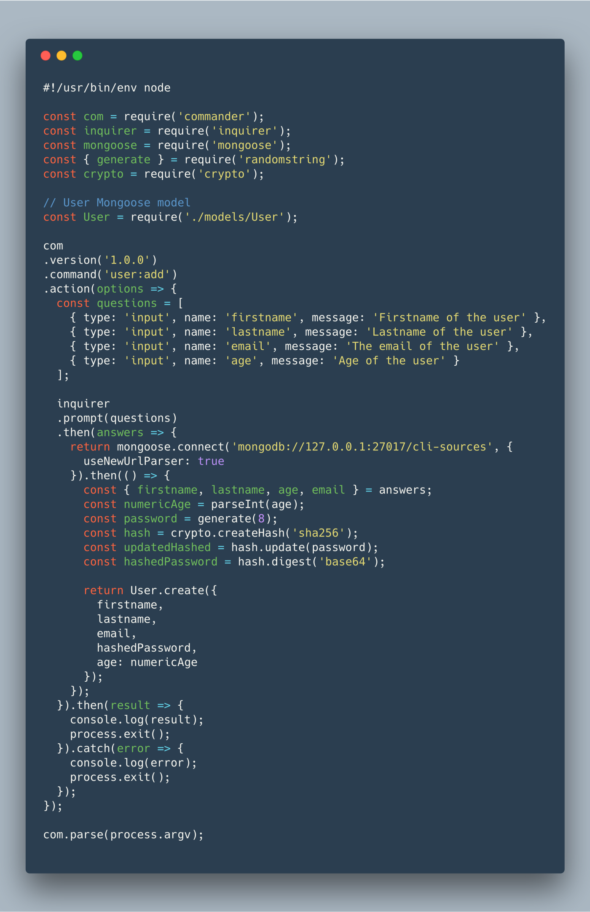
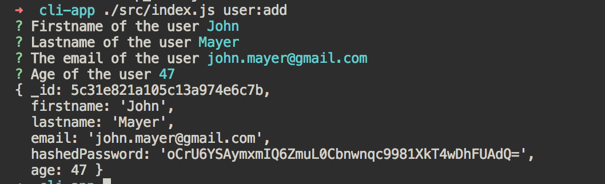
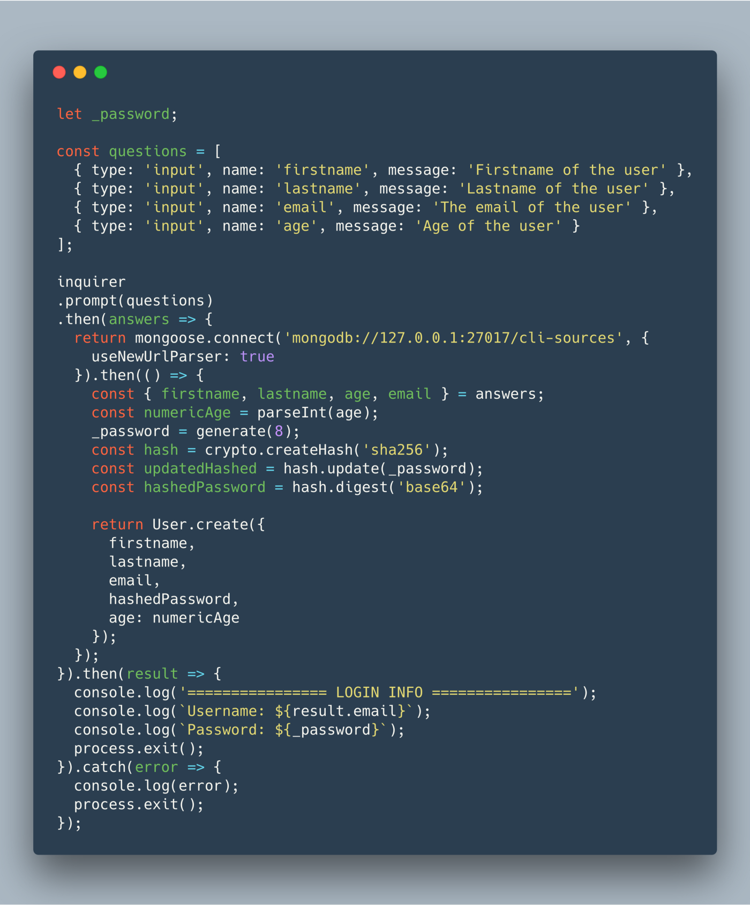
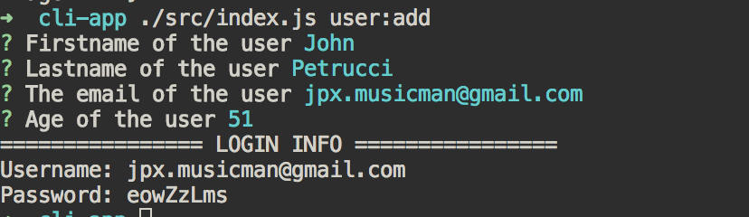
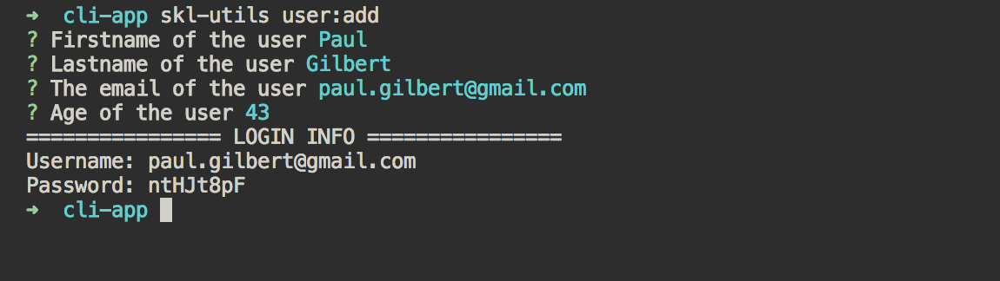

# [Build an interactive CLI application w/ Node.js, Commander, Inquirer, and Mongoose](https://medium.com/skilllane/build-an-interactive-cli-application-with-node-js-commander-inquirer-and-mongoose-76dc76c726b6)

Simple calculator that adds two numbers:



We can save it as “customcalc” w/o extension. Then I run the following code to make the file executable.

```
root@twice:customcalc$ chmod +x ./customcalc
```

Then, I can execute the script this way:

```
root@twice:customcalc$ ./customcalc
```

You can notice that you need to run the script in the customcalc directory or it is not found.

To make this available globally we need to put the script in /usr/bin or /usr/local/bin. So we run the command

```zsh
root@twice:customcalc$ cp ./customcalc /usr/local/customcalc
```

After running the above command, the script will be globally available in your system. You can simply run the below command anywhere and your script will work

```zsh
root@twice:~$ customcalc
```

You may probably wonder “So I can just use Bash to build CLI apps?”. The answer is yes! you can but the script above seems oversimplified. In reality, applications that respond to the businesses utilise databases to gather and persist information.

Bash also allows you to do this. But! trust me you wouldn’t want to do it because you will end up doing messy inline execution of SQL statement just to only get a simple result like the total number of users. See below example and you may freak out!



Very messy as it looks. This is just a simple query. If it evolved into some complex queries or implementing subqueries, it’d be more complex.

## The basic usage

We will use the following modules to build our CLI application:

* `Commander` ― the module that helps us construct our CLI interface

* `Inquirer` ― a collection of interactive interfaces for CLI applications

Let's start by adding dependencies

```
root@twice:cli-app$ yarn add commander inquirer
```

Then create an `index.js` file with the following content:

```js
// index.js

#!/usr/bin/env node

const app = require('commander');

app
.version('1.0.0')
.option('-e, --environment <environment>', 'Environment to work with')
.action(options => {
    console.log(options.environment);
});

app.parse(process.argv);
```

Save the file and execute the below script to make the file executable:

```zsh
root@twice:cli-app$ chmod +x ./index.js
```

Then execute the command w/

```
root@twice:cli-app$ ./index.js -e production
```

or

```
root@twice:cli-app$ ./index.js --environment production
```

So you get the result as “**production**” as you parse the option into the command.

You are also allowed to define multiple options to be used in your command.

```js
#!/usr/bin/env node

const app = require('commander');

app
.version('1.0.0')
.option('-e, --environment <environment>', 'Environment to work with')
.option('-n, --name [name]', 'The name', 'admin')
.action(options => {
    console.log(options.environment);
});

app.parse(process.argv);
```

You get the idea from the code above. We import `Commander` module. Then we construct our application w/ the `.option()` method that allows us to parse the option to the application.

However, there is something to explain here:

The line

```js
option('-e, --environment <environment>', 'Environment to work with')
```

indicates the option accepts the environment value and it is mandatory. Take a look at the value in the angled bracket (<option>)

```js
-e, --environment <environment>
```

Which means if you specify the option without supplying the value like this:

```zsh
root@twice:cli-app$ ./index.js -e
```

It will crash! However, it is okay if you do not specify the option in the command. In this case the value of the option will be **undefined**.

We can make this option optional by changing the angled bracket to square bracket ([option]). This way, you are not required to supply the value to the option and it is left undefined.


```js
option('-e, --environment [environment]', 'Environment to work with')
```

See the example below:

```
root@twice:cli-app$ ./index.js -e

OR

root@twice:cli-app$ ./index.js
```

The value in the bracket is a placeholder for that option and it is very useful for documentation

You can set the default value to the option. This way, if you do not supply the value or specify the option, the default value will be used.

```js
option('-e, --environment [environment]', 'Environment to work with', 'development')
```

Note that if you use the default value for the mandatory option. In case if you specify it, you still need to supply the value. But if you do not, the default value will be used instead.

If you just need to use an option as a flag, just define the option w/o bracket. This way the option is undefined unless you specify one.

```js
option('-r, --return', 'Return result')
```

With the above code. If you specify:

```zsh
root@twice:cli-app$ ./index.js --return
```

The value of `return` option will be `true` or `undefined` if not specified.

You can not use the the `default` value with the option without bracket. The value of this option can either be `true` or `undefined`.

Now you can use the action method which takes the function to execute. This is the heart of your command as it contains operations of your application.

From the above example, you can see the **options object** is parsed as an argument. This is the values you pass to the command via option method. See below example:

```js
app
.version('1.0.0')
.option('-n, --name [name]', 'The name')
.action(options => {
  console.log(options.name, 'The name parsed');
});
```

You can use either `-n` or `—-name` as the option and as mentioned previously, *using the square bracket means this is not mandatory which means you do not need to supply the value*.

### Working w/ sub-commands

Above examples show how you can create the command line application that can be called with options.

However, most CLI applications consist of sub-commands which allow you work on different tasks. A good example is `Git`.

When you work with Git, you may use `git pull` or `git push`. You can notice that each performs different tasks. In this case `git` is considered a command and `pull` or `push` is considered a sub-command of `git`.

We can do this with `Commander` module via `command()` method. See below example:

```js
// index.js

#!/usr/bin/env node

const app = require('commander');
const chalk = require('chalk');
const { list } = require('./services');

app
.version('1.0.0')
.command('list <type>')
.option('-c, --color', 'Displayed with color')
.action((type, options) => {
    const { color } = options;
    const result = list(type);

    console.log(color ? chalk.green(result) : result);
});

app.parse(process.argv);
```

From the code above, we create a sub-command named `list` which takes a mandatory argument `type` which will be used during the execution. It takes an optional option `color` to determine whether to display the result in color using `Chalk` module or not.

The same rule of option is applied to the argument. If the argument is in he angled bracket (`<>`), it is mandatory. If it is in the square bracket (`[]`), it is optional.

Now you need to run the script with the following pattern

```
root@twice:cli-app$ ./index.js list users --color
```

## Create interactive inputs w/ inquirer

Now you have learned how to use Commander to run some actions. What if our application need an input. In this case we need to make use of the module “Inquirer” which is an interactive CLI interface.

```js
const inquirer = require('inquirer');

const receiver = () => {
    inquirer.prompt([
        { type: 'input', name: 'name', message: 'Your Name' }
    ]).then(answers => {
        console.log(`Hello ${answers.name}`);
    });
}
```

When you run the script, it will ask for your name:

```
→ cli-app ./src/index.js
? Your Name ▍
```

Just fill in the name and it will return `Hello <Your name>` to the console.

For example, I will fill in my name and this is the result I get from the console:

```
→ cli-app ./src/index.js
? Your Name Aom
Hello Aom
▍
```

## Application installation

We finally come up with this interactive command line application that receives the name and prints the greeting message to the user.

```js
#!/usr/bin/env node
'use strict';

const app = require('commander');
const inquirer = require('inquirer');

const receiver = () => {
    inquirer.prompt([
        { type: 'input', name: 'name', message: 'Your Name' }
    ]).then(answers => {
        console.log(`Hello ${answers.name}`);
    });
};

app
.version('1.0.0')
.action(receiver);

app.parse(process.argv);
```

We need to make our application globally available on the machine which means you do not have to go to the directory of the script and run something like:


```zsh
root@twice:cli-app$ ./script.js -e staging
```

It is not an ideal. You should be free to call the command anywhere on your machine.

In order to make the application globally available on your system, you need to add the following line in your `package.json` file. Let's name it `cli-app`.

```json
"bin": {
    "cli-app": "./index.js"
}
```

This maps the command name `cli-app` to the `index.js` file. So calling `cli-app` is equivalent to calling `./index.js` file.

The next step is to install the application. Run the below command:

```zsh
root@twice:cli-app$ npm install -gs ./
```

The flag `-s` or `—-silent` is used to reduce the noise caused by `npm install` command.

It will install your application in the global directory. So when you run

```zsh
root@twice:cli-app$ cli-app
```

You will be prompted with the interactive input that asks for your name. Fill it in and you will see the greeting message like this.

```
→ cli-sample cli-app
? Your Name John
Hello John
→ cli-sample ▍
```

Okay. Let’s discuss what we will be building by combining what we have been doing so far.

## The workshop: Create the user

Here is the list of libraries and modules we are going to use in this workshop:

* **`Commander`** — the module that helps us construct our CLI interface

* **`Inquirer`** — a collection of interactive interfaces for CLI application

* **`Mongoose`** — MongoDB ODM to interact w/ the database

* **`Randomstring`** — the module that generates random string to be used as the password of the user being created

* **`Crypto`** — the default module for working w/ cryptography in Node.js. We will be using this module to hash our password for the user being created

What we will be building today is a CLI tool that generates the user for the application. It adds the `name`, `email`, and `password` then return the newly created `result` to the console.

We will use `Mongoose` as an ODM to interact with the database. It is treated as a Data Access Object for our users collection. However, we need to create a model for `Mongoose` first. Here is what the model for `users` collection looks like:

```js
// models/users.js

const { Schema, model } = require('mongoose');

const UserBlueprint = Schema({
    firstname: String,
    lastname: String,
    email: String,
    hashedPassword: String,
    age: Number
}, {
    versionKey: false
});

module.exports = model('User', UserBlueprint);
```

Now that you have your model in place. You are ready to go. You can start by importing the User model to your CLI interface. So your CLI interface should look something like this.

```js
// index.js

import mongoose from 'mongoose';
import User from './models/User';
import App from 'commander';

const mockedUser = {
    firstname: 'John',
    lastname: 'Mayer',
    email: 'jm.mayer@gmail.com',
    hashedPassword: 'gvk004tij=v;fggf6^',
    age: 47
};

App
.version('1.0.0')
.action(options => {
    mongoose.connect('mongodb://127.0.0.1:27017/cli-source', {
        useNewUrlParser: true
    }).then(() => {
        return User.create(mockedUser);
    }).then(response => {
        console.log(response);
        process.exit();
    });
});
```

Okay, simple enough as we use the `mockedUser` object to create the new entry in the users collection.

But in reality, we do not work with the hard-coded object like this. The CLI applications receive input values to work with the database and we can do it using **options or interactive input**.

I personally prefer interactive input to the option parameters because it is more interactive. That’s how **`Inquirer` module** comes into play.

We are going to need `firstname`, `lastname`, `age`, and `email` of the user while the `password` will be randomly generated.

I name the sub-command `user:add` so we can define it using the `command()` method.

So this is how the command looks:



Don’t forget to add the shebang line on the topmost of the file so that we can run the command directly using the interpreter of our choice. In this case we use `node`. So it is `/usr/bin/env node`

Now save it as `index.js` and run the script with below command:

```zsh
root@twice:cli-app$ ./index.js
```

You will be prompted with the interactive input. Just fill in the information and you will get the result.

Upon the execution, the application connects to MongoDB on the localhost and create the user. Finally the response is returned with the object of created user.



However, this is just a Mongoose default response from creation process. In reality we only need the login information to be given to the user not everything in the document. We will adjust some output. Let’s do it.

We will only display the `email` and the `password` for the user as the output and here is how we can do it. Let’s modify our code in `action()` method callback.



We move the `_password` variable outside the promises to avoid problem accessing the variable from inner promise blocks and we assign the variable with the randomly generated password. Finally, we make use of it and display it to the user as the result



Looks like our CLI application is ready to be used. Let’s modify the `package.json`. I will name my application `skl-utils`.

```json
// package.json

"bin": {
  "skl-utils": "./index.js"
}
```

Now, let’s install the application on your machine by running

```zsh
root@twice:cli-app$ npm install -gs ./
```

After running the command, you should have `skl-utils` installed on your machine. So let’s run the command and you should see the result.



## Epilogue

We’ve created a CLI application that prompts the users with interactive inputs, connects to MongoDB and creates the user using Commander, Inquirer, and Mongoose.
